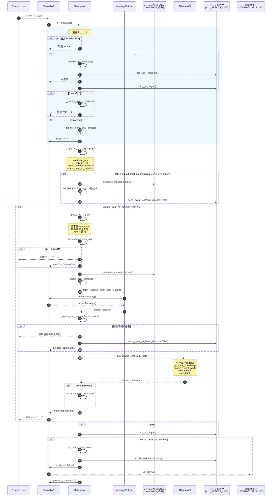
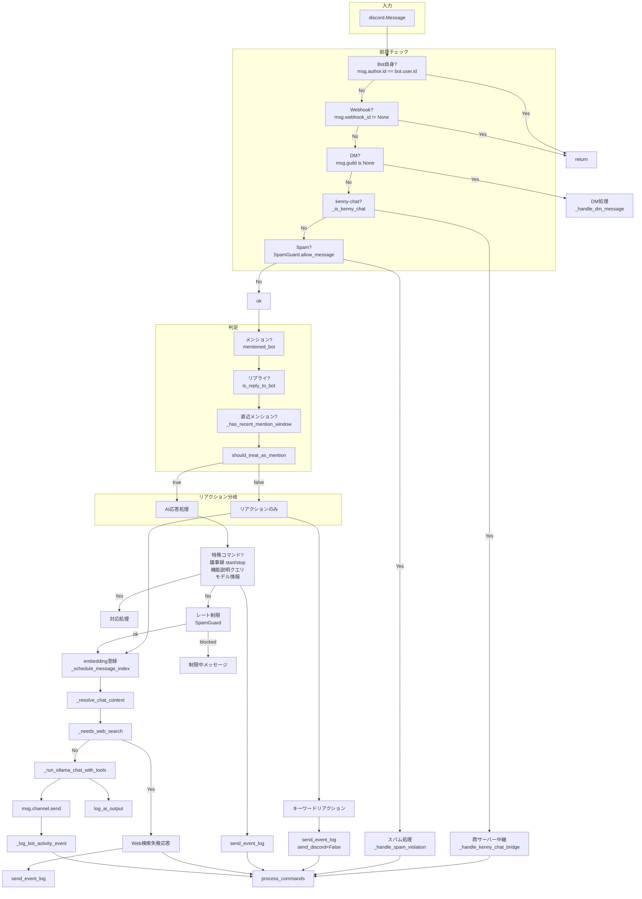
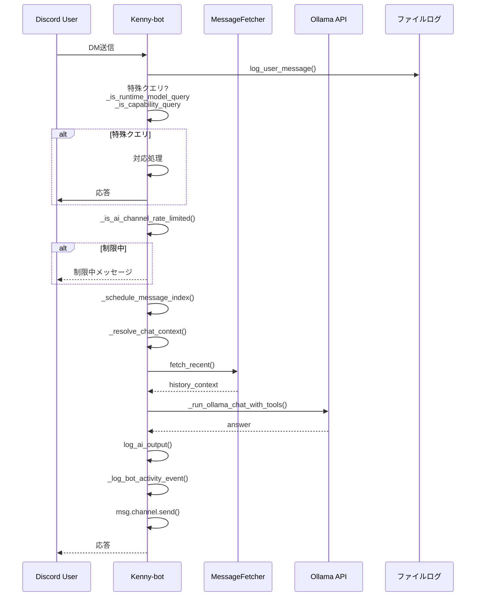
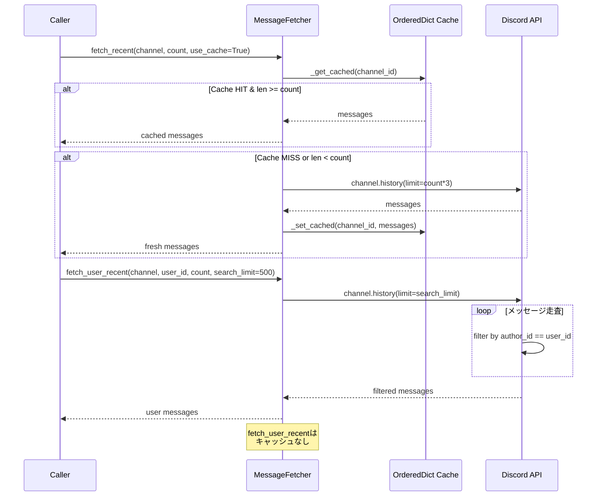
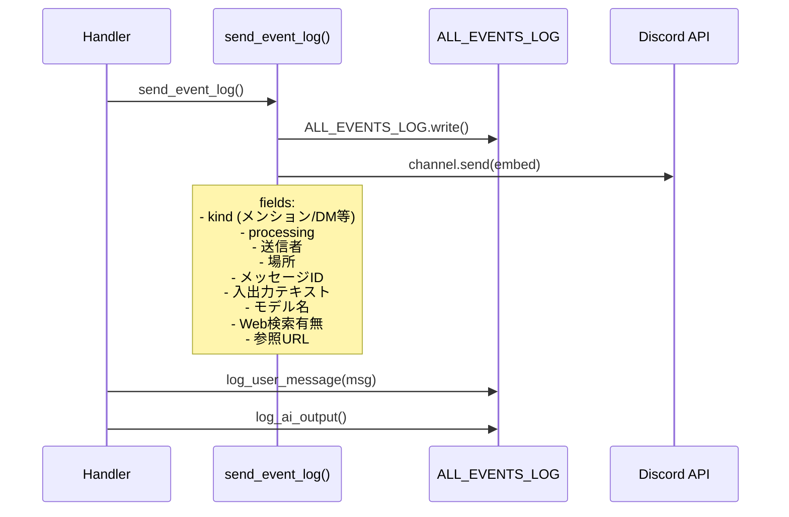

# Kenny-bot メッセージ処理フロー

## 概要

```
Discord Message → on_message → 判定 → 処理分岐 → (AI応答 | リアクション) → 管理ログ
```

## 全体シーケンス



## on_message 詳細



## _handle_dm_message 詳細



## _resolve_chat_context 詳細

```mermaid
flowchart TD
    subgraph 入力
        MSG[discord.Message]
        TEXT[メッセージ本文]
        USER_DISPLAY[ユーザー表示名]
    end

    subgraph 設定値
        UL[user_lines: 24\nchat.user_history_lines]
        CL[channel_lines: 16\nchat.channel_history_lines]
    end

    subgraph 取得計画
        PLAN[_build_retrieval_plan]
        PRIORITY[_prioritize_mentioned_person_plan]
    end

    subgraph source種類
        RECENT_USER[recent_user_history]
        MEMBER_HIST[member_history]
        RECENT_TURNS[recent_turns]
        CHANNEL_HIST[channel_history]
        REPLY_CHAIN[reply_chain]
        SEMANTIC[semantic_history]
        LOCAL_KNOW[local_knowledge]
        MEMBER_PROFILE[member_profile]
        CHANNEL_PROFILE[channel_profile]
        WEB[web_search]
        BOT_COMMAND[bots_command_catalog]
        BOT_GAME[bot_game_catalog]
        RUNTIME_MODEL[runtime_model]
        VRCHAT[vrchat_world]
    end

    subgraph Fetcher
        FETCH[MessageFetcher]
        HISTORY[Discord API\nchannel.history()]
        CACHE[(OrderedDict\n30秒TTL)]
    end

    subgraph VectorStore
        VS[MessageVectorStore]
        EMBEDDING[SQLite\nembedding検索]
    end

    subgraph ローカルRAG
        LRAG[LocalRAG\n_get_local_knowledge]
    end

    subgraph 出力
        CONTEXT[history_context文字列]
        REFS[references list]
        WEB_Q[web_queries list]
        DETAILS[reference_details list]
    end

    MSG --> PLAN
    TEXT --> PLAN
    USER_DISPLAY --> PLAN
    UL --> RECENT_USER
    UL --> MEMBER_HIST
    CL --> RECENT_TURNS
    CL --> CHANNEL_HIST

    PLAN --> PRIORITY
    PRIORITY --> RECENT_USER
    PRIORITY --> MEMBER_HIST
    PRIORITY --> RECENT_TURNS
    PRIORITY --> CHANNEL_HIST
    PRIORITY --> REPLY_CHAIN
    PRIORITY --> SEMANTIC
    PRIORITY --> LOCAL_KNOW
    PRIORITY --> MEMBER_PROFILE
    PRIORITY --> CHANNEL_PROFILE
    PRIORITY --> WEB
    PRIORITY --> BOT_COMMAND
    PRIORITY --> BOT_GAME
    PRIORITY --> RUNTIME_MODEL
    PRIORITY --> VRCHAT

    RECENT_USER --> FETCH
    MEMBER_HIST --> FETCH
    RECENT_TURNS --> FETCH
    CHANNEL_HIST --> FETCH
    REPLY_CHAIN --> FETCH

    FETCH --> CACHE
    FETCH --> HISTORY
    HISTORY -->|discord.Message[]| FORMAT[format_messages_for_context]
    FORMAT --> CONTEXT

    SEMANTIC --> FETCH_EMBED[_embed_text]
    FETCH_EMBED --> EMBEDDING
    EMBEDDING --> FORMAT_VS[format_results]
    FORMAT_VS --> CONTEXT

    LOCAL_KNOW --> LRAG
    LRAG --> CONTEXT

    VRCHAT --> VRAPI[search_vrchat_world]
    VRAPI --> CONTEXT
```

## MessageFetcher 詳細



## ログ記録の詳細



## 状態遷移

```mermaid
stateDiagram-v2
    [*] --> 前提チェック
    前提チェック --> DM処理: msg.guild is None
    前提チェック --> kenny-chat: _is_kenny_chat
    前提チェック --> Spam処理: SpamGuard
    前提チェック --> continue: OK

    DM処理 --> log_user_message
    DM処理 --> 特殊クエリ判定
    DM処理 --> レート制限
    DM処理 --> embedding登録
    DM処理 --> コンテキスト解決
    DM処理 --> Ollama応答
    DM処理 --> log_ai_output
    DM処理 --> 管理ログ記録
    DM処理 --> [*]

    kenny-chat --> 中継処理
    kenny-chat --> [*]

    Spam処理 --> [*]

    continue --> メンション判定
    メンション判定 --> リアクション: not should_treat_as_mention
    メンション判定 --> 特殊処理: should_treat_as_mention

    特殊処理 --> 特殊応答: 議事録/機能説明
    特殊応答 --> 管理ログ記録
    特殊応答 --> [*]

    特殊処理 --> レート制限
    レート制限 --> 制限中: blocked
    レート制限 --> continue2: ok
    制限中 --> [*]

    continue2 --> Embedding登録
    continue2 --> Web検索判定
    Web検索判定 --> Web失敗: 必要
    Web失敗 --> [*]
    Web検索判定 --> AI応答: 不要

    リアクション --> Embedding登録
    リアクション --> キーワードリアクション
    リアクション --> [*]

    AI応答 --> コンテキスト解決
    コンテキスト解決 --> Ollama呼び出し
    Ollama呼び出し --> 応答送信
    応答送信 --> 管理ログ記録
    管理ログ記録 --> [*]
```

## 主要ファイル対応表

| ファイル | 役割 |
|---------|------|
| `cogs/message_logger.py` | メイン処理ロジック (on_message, _handle_dm_message等) |
| `cogs/slash_commands.py` | スラッシュコマンド処理 |
| `cogs/game_commands.py` | ゲームコマンド |
| `cogs/voice_logger.py` | 音声ログ |
| `cogs/member_logger.py` | メンバーログ |
| `cogs/audit_logger.py` | 監査ログ |
| `cogs/reaction_roles.py` | リアクションロール |
| `cogs/tts_reader.py` | TTS読み上げ |
| `cogs/mod_panel.py` | モデレーションパネル |
| `utils/message_fetcher.py` | Discord API (channel.history) + 短期キャッシュ |
| `utils/message_vector_store.py` | embedding保存・検索 (SQLite) |
| `utils/event_logger.py` | 管理ログ送信 (send_event_log) |
| `utils/message_logger.py` | ファイルログ (log_user_message, log_ai_output等) |
| `utils/local_rag.py` | ローカルナレッジベース |
| `utils/spam_guard.py` | スパム検出・レート制限 |

## 設定値

| キー | デフォルト | 説明 |
|------|-----------|------|
| `chat.user_history_lines` | 24 | ユーザー履歴取得件数 |
| `chat.channel_history_lines` | 16 | チャンネル履歴取得件数 |
| `chat.semantic_history_k` | 6 | セマンティック検索件数 |
| `chat.max_response_length` | 1800 | 応答最大文字数 |
| `security.max_user_message_chars` | 1200 | ユーザーメッセージ最大文字数 |
| `security.ai_channel_cooldown_seconds` | 4 | AI応答間隔制限 |

## 削除した機能 (v2)

| 項目 | 旧方式 | 新方式 |
|------|--------|--------|
| メッセージ保存 | MessageStore → JSONファイル | なし |
| 履歴取得 | store.get_recent_messages() | MessageFetcher.fetch_recent() |
| 送信記録 | store.add_message() | 削除 (embeddingのみでOK) |
| Storage | data/message_logs/*.json | なし |

## 変更なし (維持)

| 項目 | 説明 |
|------|------|
| log_user_message() | ファイルログ (ALL_EVENTS_LOG) |
| log_ai_output() | ファイルログ (AI応答記録) |
| send_event_log() | Discord管理ログ + ファイルログ |
| _log_bot_activity_event() | 管理ログEmbed生成 |
| _schedule_message_index() | embedding登録 (バックグラウンド) |