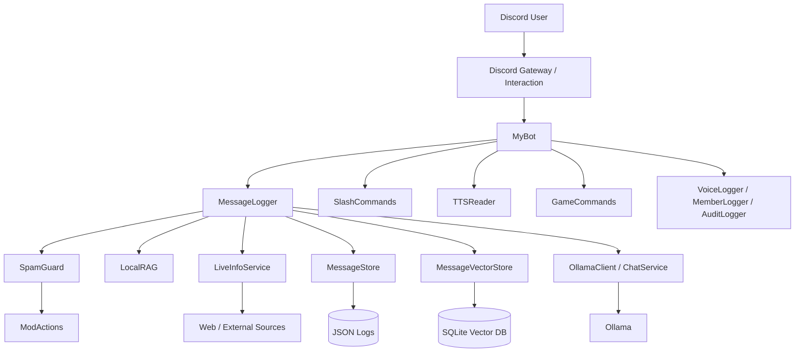
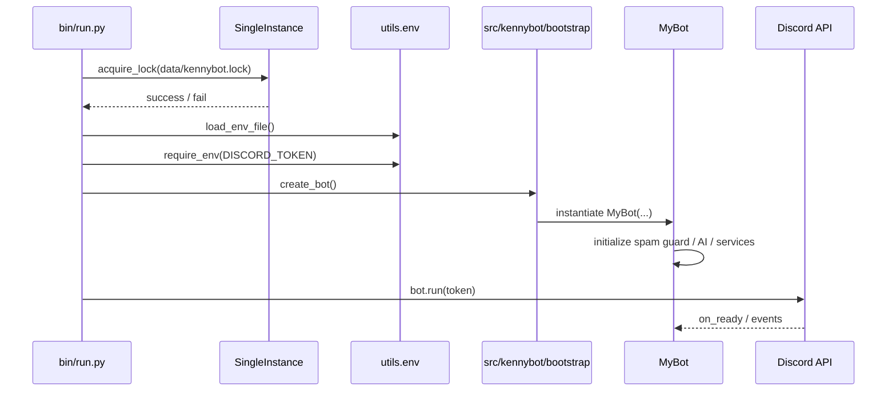
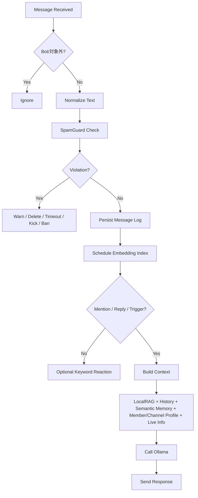
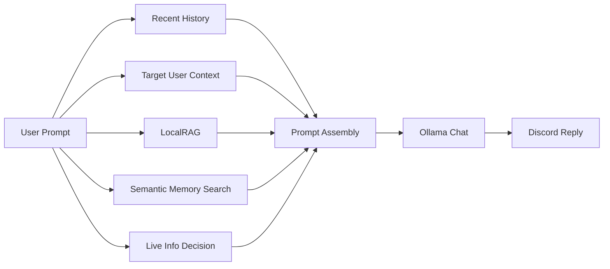
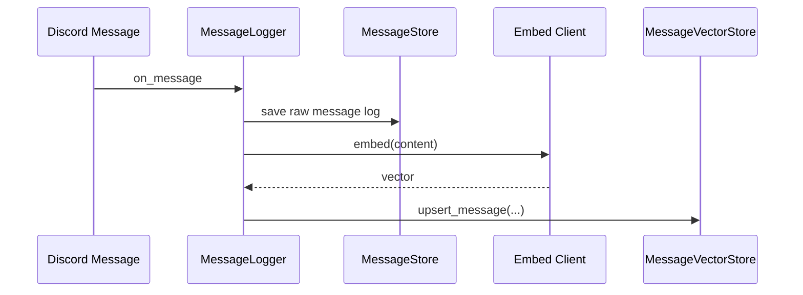
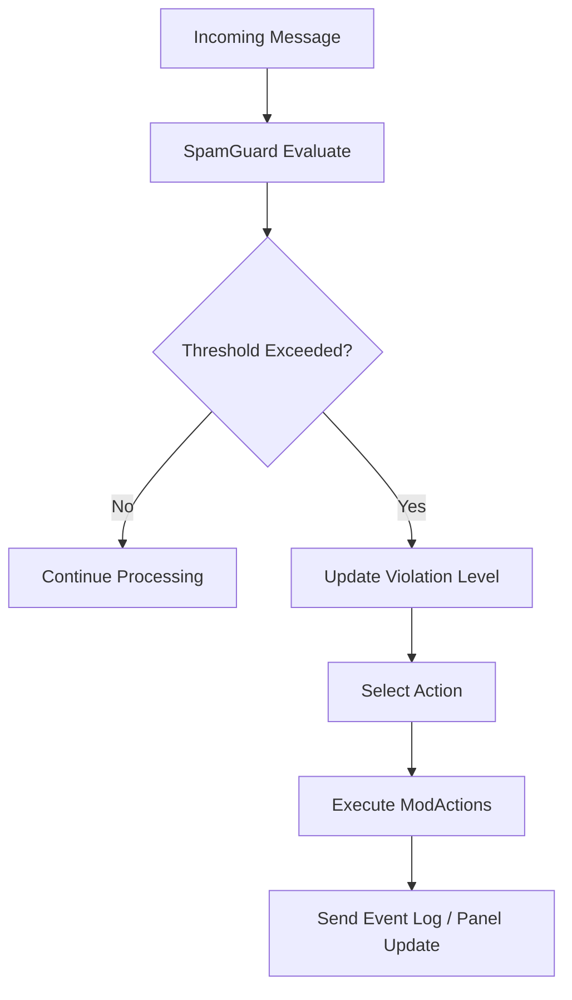
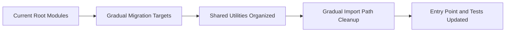

# Kenny Bot 設計書

## 1. 概要

Kenny Bot は Discord サーバー向けの多機能 Bot であり、主に以下を提供する。

- AI 会話応答
- スパム検知とモデレーション補助
- 音声読み上げ、文字起こし、要約
- ゲーム系コマンド
- メッセージ履歴と意味検索ベースの補助記憶

README は利用者向けの概要とセットアップに絞り、本書は実装者向けの設計資料として扱う。

## 2. 設計目標

- Discord 上のイベントを安定して処理する
- AI 機能を Bot 本体から分離し、差し替えや拡張をしやすくする
- メッセージ履歴、ローカル知識、外部情報を組み合わせて応答品質を上げる
- スパムや過剰な AI 呼び出しを抑制し、運用コストを下げる
- 既存コードをルート直下の構成で維持しつつ、設定・ログ・RAG は `data/channel_rag/<guild_id>/` にスコープ分離できるようにする
- 将来の生成物は `runtime/` に集約し、移行は段階的に行う

## 3. 論理構成

### 3.1 モジュール責務

- `bin/`
  - 起動シェルラッパー
  - `.env` 読み込み
  - 多重起動防止
- `src/kennybot/`
  - 将来の機能分割に向けた canonical な起動・初期化入口
  - `features/chat/` から順に機能実装を移す受け皿
  - `ai/`, `cogs/`, `guards/`, `commands/`, `utils/` は既存互換ラッパーとして mirror する
- `bot.py`
  - Bot インスタンス生成
  - 主要サービス初期化
  - Cog 登録
  - グローバルエラーハンドリング
- `cogs/`
  - Discord イベントや slash command の受け口
  - 個別機能単位のユースケース制御
- `ai/`
  - Ollama 実行
  - 会話生成
  - 外部検索や要約
  - 音声認識や画像補助
- `guards/`
  - スパム判定
  - モデレーション実行
- `utils/`
  - 設定、スコープ付きデータ、ログ、履歴、ベクトル保存、RAG、補助処理
- `doc/`
  - 設計書、仕様書、運用文書
- `runtime/`
  - 生成物、キャッシュ、状態、移行中の成果物を集約する予約領域
- `src/`
  - 将来の実装コードの集約先候補

### 3.2 全体アーキテクチャ

## 4. 起動設計

起動は `bin/run.py` を起点とし、環境読み込みと排他制御を先に行ってから `src/kennybot/bootstrap.py` の初期化ヘルパーへ渡す。

### 4.1 起動シーケンス

### 4.2 起動時の重要ポイント

- 多重起動は `data/kennybot.lock` で防止する
- `MyBot` 初期化時に AI クライアント、スパムポリシー、議事録管理、進捗トラッカーを組み立てる
- `setup_hook()` で Cog を登録する
- `on_ready()` で slash command 同期を実施する

## 5. 会話処理設計

`cogs/message_logger.py` が通常メッセージ処理の中心である。ここでリアクション、会話、履歴保存、意味検索、外部情報補助が交差する。

- 会話ロジックの本体は `src/kennybot/features/chat/` に移設を開始した
- `ai/chat.py` は既存 import 維持のための互換ラッパーとして残している

### 5.1 メッセージ処理フロー

### 5.2 応答コンテキストの構成

AI 応答時は単一の情報源ではなく、複数の補助コンテキストを組み合わせる。

- 直近の会話履歴
- 発言者や返信先に応じた対象ユーザー履歴
- `LocalRAG` によるローカル知識
- `MessageVectorStore` による意味的に近い過去発言
- 必要時のみ `LiveInfoService` による外部情報

### 5.3 会話フロー詳細

### 5.4 プロフィールと RAG の優先順位

- `member_profile`
  - 対象ユーザーのニックネーム、ロール、参加日時、アカウント作成日、状態、アクティビティをまとめた一括プロフィール
  - `getplayerinfo` 相当の内部抽象として扱う
- `channel_profile`
  - サーバー、チャンネル、ワールドの正式プロフィール
  - `getserverinfo` 相当の内部抽象として扱う
- `LocalRAG`
  - `knowledge/` と `data/channel_rag/<guild_id>/` 以下の説明、ルール、設定を参照する
- `Retrieval Planner`
  - 明示メンション、返信先、対象名から取得対象を決める
  - `どんな人？` 系は人物本人の発言履歴とプロフィールを優先する
  - `このサーバーは何のやつ？` 系は場所プロフィールを優先する

## 6. メッセージ保存設計

メッセージ保存は二層で行う。

- 可読な履歴保存: JSON ベース
- 類似検索用保存: SQLite ベースのベクトルストア

### 6.1 保存の狙い

- 監査や会話文脈の再利用を可能にする
- 同一チャンネルや関連ユーザーの過去発言を参照できるようにする
- embedding を用いた意味検索により、単純な全文一致では拾えない関連会話を取得する

### 6.2 保存フロー

### 6.3 スコープ付きデータ

- `utils/scoped_data.py` が `data/channel_rag/<guild_id>/` 以下の設定・RAG データと `runtime/logs/channel_rag/<guild_id>/` 以下のログ保存先を分けてまとめる
- `utils/message_store.py` は新規のメッセージ履歴を `runtime/logs/message_logs/` に保存し、旧保存先は読み取り互換として残す
- `utils/message_logger.py` と `utils/event_logger.py` は、サーバー/チャンネル別のログを `runtime/logs/channel_rag/<guild_id>/logs/` と `runtime/logs/channel_rag/<guild_id>/channels/<channel_id>/logs/` に書き出す
- フォルダが未作成でも保存前に作成するため、初回参照で落ちない

## 7. モデレーション設計

モデレーションは `SpamGuard` と `ModActions` の分担で構成される。

- `SpamGuard`
  - 投稿頻度
  - 重複メッセージ
  - AI 呼び出し頻度
  - 警告クールダウン
- `ModActions`
  - メッセージ削除
  - タイムアウト
  - キック
  - バン

### 7.1 モデレーション判定フロー

## 8. 音声・周辺機能設計

音声系は会話系とは別責務で動くが、Bot 本体の初期化とイベント基盤を共有する。

- `TTSReader`
  - VOICEVOX 読み上げ
- `VoiceLogger`
  - ボイスチャンネル関連イベント
- `ai/google_speech.py`
  - Google Speech-to-Text
- `utils/meeting_minutes.py`
  - 議事録管理

音声認識は Google Speech-to-Text を優先し、失敗時に別系統へフォールバックする想定で設計されている。

## 9. エラー処理方針

- アプリコマンドの例外は `MyBot.on_app_command_error()` に集約する
- 未処理イベント例外は `MyBot.on_error()` で記録する
- `send_event_log()` はボット由来の操作ログに限定し、`source_channel_id` が統一ログチャンネルと一致する場合は送信しない
- 通常メッセージ由来の反応や監査ログは、ボットに関係するものだけを統一ログへ流す
- 外部依存の失敗は、可能であればフォールバックする
- Gemini の `generateContent` が 429 / クォータ超過になった場合は、`OLLAMA_FALLBACK_MODEL` と `ollama.model_chat` / `ollama.model_summary` を順に試して Ollama へ切り替える
- サーバー固有の説明は `data/channel_rag/<guild_id>/chat_rag.md` に、チャンネル固有の説明は `data/channel_rag/<guild_id>/channels/<channel_id>/` に保存し、会話応答のローカル知識として参照する
- 録音系の設定は `recorder.default_format` / `recorder.max_minutes` / `recorder.silence_timeout_seconds` / `recorder.max_tracks` / `recorder.auto_cook_formats` を使い、外部録音の停止と後処理に反映する
- `meeting.audio_max_total_mb` / `meeting.audio_max_user_mb` は `0` を無制限として扱い、メモリ上限をかけたいときだけ有効化する

## 10. ディレクトリ方針

### 10.1 現状

- 既存コードはルート直下の `ai/`, `cogs/`, `guards/`, `utils/`, `commands/` に分かれている
- エントリポイントは `bin/run.py`
- 設計書は `doc/` に配置する
- 主要な実行経路はルート直下のモジュールを前提にしている

### 10.2 今後の方針

- `src/` は将来の整理先として残し、移行する場合は段階的に行う
- 既存コードは無理に一括移行せず、変更対象に近い単位で段階移行する
- import パス、起動スクリプト、テスト手順を壊さないことを優先する
- サーバー知識は `data/channel_rag/<guild_id>/chat_rag.md` を、チャンネル知識は `data/channel_rag/<guild_id>/channels/<channel_id>/` を直接編集して追加する

### 10.3 想定移行イメージ

## 11. 実装時の運用ルール

- 機能追加時は、必要なら `doc/feature-<name>.md` を追加する
- 大きな構成変更時は本書を更新する
- README には詳細設計を戻さず、参照リンクを置く
- 外部依存の増減があればセットアップ手順も更新する

## 12. 未整理事項

- `src/` への具体的な移行単位はまだ未確定
- テスト構成と CI 方針は別文書化していない
- AI 機能のプロンプト設計詳細は専用文書化されていない
